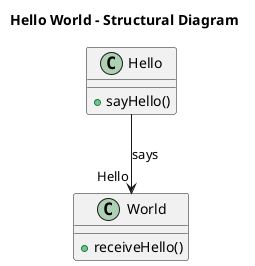
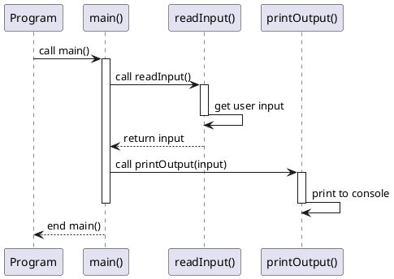

We did three things this quarter. 
- PlantUML diagrams
- Design pattern implementation
- dipping our toes into REST APIs

  

PlantUML is a tool that generates diagrams based on their domain-specific language. 
Here's an example structural diagram:

There are also ones known as "Sequence Diagrams" that outline a program's flow of operations while showing the scope of each variable. I don't know when it'd come in handy but that may change once I do the capstone assignment.

They look something like this: 

  

We then applied what we learned to refactor a duck codebase into variants that follow the Strategy and Singleton patterns. The usage of a structural diagram helped visualize the attribtues and relations between classes immensely. I'd see myself using at least the structural diagrams for collaborative projects as we'd iron out a design for our codebase to follow. 

